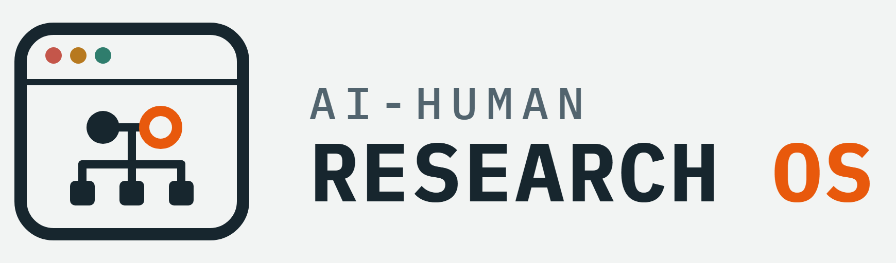
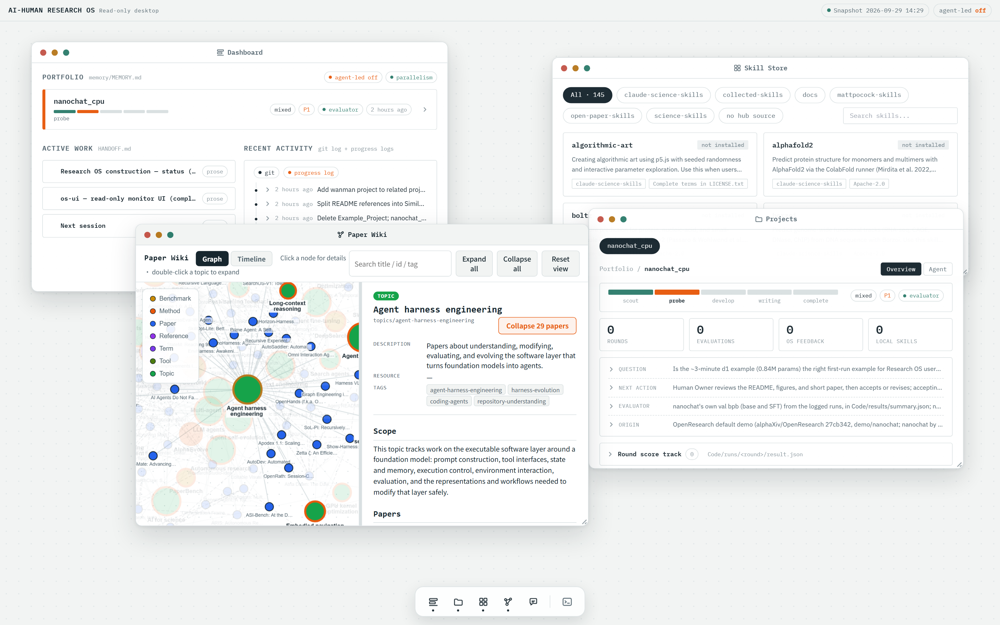

<p align="center">
  <picture>
    <source media="(prefers-color-scheme: dark)" srcset="docs/brand/logo-lockup-white.png">
    <source media="(prefers-color-scheme: light)" srcset="docs/brand/logo-lockup.png">
    
  </picture>
</p>

# AI-Human Research OS

[](os-ui/README.md)

<p align="center"><sub>The optional <a href="os-ui/README.md">os-ui</a> desktop, rendered from this repository's own files.</sub></p>

[](LICENSE)
[](#quick-start)
[](#core-directories)

A lightweight, folder-based research operating system for humans working with
code agents such as Codex and Claude Code. The agent is the execution core; the
human steers in natural language. The core has no database, server, or CLI —
just a stable directory layout, a few conventions, and reusable skills, so
agents can support long-term, iterative research with low token cost. Two
optional layers sit on top: a browser desktop for watching the OS, and a
harness that runs Claude Code and Codex on your own subscriptions (see
[Optional Layers](#optional-layers)).

The folder structure is intentionally simple and non-linear. Research ideas,
references, experiments, figures, and writing often update each other, so the
folders are organized by material type rather than by a fixed workflow.

## Table of Contents

- [Current Design Stance](#current-design-stance)
- [Quick Start](#quick-start)
- [Core Directories](#core-directories)
- [Minimal Workflow](#minimal-workflow)
- [Optional Layers](#optional-layers)
- [Contributing](#contributing)
- [License](#license)
- [Roadmap](#roadmap)
- [Similar Projects](#similar-projects)

## Current Design Stance

This OS is best understood as a file-system-native environment for long-horizon
human-agent research. The human user's research practice is the primary target;
reusable open-source templates are a byproduct, and product/platform ideas stay
future-compatible without driving current complexity.

The default operating policy is **portfolio always on, intra-project parallelism
on demand**. Multiple projects can be tracked at once, but multi-agent execution
inside a project should start only when the task is decomposable, verifiable, and
worth the merge cost. Agent-led research is controlled by the `agent_led_research`
policy in [memory/MEMORY.md](memory/MEMORY.md): `off`, `scout_only`, or
`full_gated`.

Human-led and agent-led work use the same evaluation stance: hard checks,
rubric scoring, and LLM critique evaluate complete artifacts such as code,
figures, references, and paper drafts, not empty ideas.

## Quick Start

1. Clone the repository and open it with Claude Code or Codex.
2. Both agents load [AGENTS.md](AGENTS.md) at startup. It sets the execution
   contract, points each kind of task to the files to read, and holds the
   memory, research-integrity, and maintenance rules.
3. Talk to the agent in natural language, e.g. "record this idea", "start a
   project from idea X", "add this paper to the paper wiki", "hand this task
   to project X".

Run [`./verify.sh`](verify.sh) from the repository root to check the paper wiki,
navigation map, project contract, installed skills, and os-ui's copies of the
brand icons. It requires a working `uv` and the Python version in
[`.python-version`](.python-version) already installed; it uses a temporary
cache and performs no downloads or project-environment sync. Runtime errors mark
dependent checks `SKIP` while independent checks continue. Exit codes: `0` = all
passed, `1` = a check failed, `2` = runtime error left checks incomplete.

## Core Directories

| Path                                                                                              | Purpose                                                                                                                                           |
| ------------------------------------------------------------------------------------------------- | ------------------------------------------------------------------------------------------------------------------------------------------------- |
| [ideas/](ideas/)                                                                                   | OKF bundle for research ideas, hypotheses, inspirations, and early discussions                                                                    |
| [inbox/](inbox/)                                                                                   | Temporary intake area for new materials before classification and archival                                                                        |
| [paper-wiki/](paper-wiki/)                                                                         | Paper notes, topic syntheses, and concepts, with a graph viewer ([online](https://pengqianhan.github.io/AI-Human-Research-OS/paper-wiki/viz.html)) |
| [projects-folder/](projects-folder/)                                                               | Research projects and reusable project templates                                                                                                  |
| [projects-folder/templates/ai_research_template/](projects-folder/templates/ai_research_template/) | AI-research paper template copied to start a new project                                                                                          |
| [memory/](memory/)                                                                                 | Global long-term memory across projects: portfolio, decisions, and policies                                                                       |
| [human/](human/)                                                                                   | Stable user context, collaboration preferences, cognition notes, and privacy boundaries                                                           |
| [research-skills-hub/](research-skills-hub/)                                                       | Canonical store of reusable agent skills                                                                                                          |
| `.agents/skills/`, `.claude/skills/`                                                          | Installed skills, symlinked or copied from the hub by`research-skill-installer`                                                                 |
| [os-ui/](os-ui/)                                                                                   | Optional browser desktop for observing OS state and talking to agents                                                                             |
| [os-harness/](os-harness/)                                                                         | Optional runner for Claude Code and Codex turns on your own subscriptions                                                                         |
| [os-build/](os-build/)                                                                             | Goals, construction manual, and read-only reference repositories for building the OS                                                              |
| [docs/](docs/)                                                                                     | Presentation draft, architecture decision records, and brand assets                                                                               |
| [AGENTS.md](AGENTS.md)                                                                             | Agent operating guide (read first)                                                                                                                |
| [CONTEXT.md](CONTEXT.md)                                                                           | Shared vocabulary, e.g. Research Task, Agent Run, Write Lease                                                                                     |
| [HANDOFF.md](HANDOFF.md)                                                                           | Cross-session record of active work and settled decisions                                                                                         |
| [FILETREE.md](FILETREE.md)                                                                         | Auto-generated top-level navigation map                                                                                                           |
| [verify.sh](verify.sh)                                                                             | Read-only consistency checks                                                                                                                      |

## Minimal Workflow

idea → [ideas/](ideas/) OKF concept or idea bundle → the `research-project-manager`
skill copies [ai_research_template/](projects-folder/templates/ai_research_template/)
to `projects-folder/<ProjectName>/` and registers it → experiments in
`projects-folder/<ProjectName>/Code/`, figures in `Figs/` → write
`paper/main.tex` with local references in `paper/references.bib` → memory updated in
project `PROJECT_MEMORY.md` and
[memory/MEMORY.md](memory/MEMORY.md). Details: [AGENTS.md](AGENTS.md).
Each project carries its own `AGENTS.md` with the template's shared rules, so
it can also stand alone as its own repository; the template is the greatest
common divisor of its projects ([template contract](projects-folder/templates/index.md)).

A complete worked example lives in
[projects-folder/nanochat_cpu/](projects-folder/nanochat_cpu/): Andrej
Karpathy's nanochat, shrunk until every stage (tokenizer, pretraining, eval,
SFT, chat) runs on a laptop-class CPU in a few minutes, with a short paper
compiled from its results. See its
[Code/README.md](projects-folder/nanochat_cpu/Code/README.md) to run it and
[paper/main.pdf](projects-folder/nanochat_cpu/paper/main.pdf) for the write-up.

## Optional Layers

Neither layer is required: the folders, conventions, and skills above work
without them.

**Root agent and project agents.** [os-harness/](os-harness/README.md) runs one
Claude Code or Codex turn in one directory through the vendors' own CLIs. Each
turn uses the login you already have (a Claude Pro/Max or ChatGPT
subscription), not an API key, and every session keeps a resumable trace. At the
repository root, the agent acts as the root agent: with the
[`project-dispatch`](research-skills-hub/open-paper-skills/project-dispatch/SKILL.md)
skill it briefs a project's agent, dispatches the work, tracks it, and reviews
the result, with at most one running session per project.

```bash
python os-harness/harness.py check   # each CLI's version and login state
```

**Browser desktop.** [os-ui/](os-ui/README.md) shows the repository's state as
a desktop with Dashboard, Projects, Skill Store, Paper Wiki, and Root Agent
windows. It never edits research files; its only actions are agent
conversations, run through os-harness, and turning installed skills on or off.

```bash
./os-ui/start.sh   # needs uv and npm; prints the local URL and the Root Agent token
```

**Desktop client.** [os-ui/client/](os-ui/client/README.md) is the same
desktop as an app for macOS, Windows, and Linux: no terminal or token, a
self-refreshing snapshot, and a notification when an agent turn ends.

Decision records: [ADR-0003](docs/adr/0003-subscription-cli-harness.md)
(subscription-CLI harness), [ADR-0004](docs/adr/0004-root-agent-as-skill.md)
(root agent as a skill), and [ADR-0005](docs/adr/0005-desktop-client.md)
(desktop client).

## Contributing

Changes reach `main` only through pull requests that pass
[CI](.github/workflows/ci.yml). See [CONTRIBUTING.md](CONTRIBUTING.md).

## License

Original content in this repository is licensed under the [MIT License](LICENSE).
Vendored or collected third-party content keeps its upstream license and
attribution:

- [research-skills-hub/science-skills/](research-skills-hub/science-skills/index.md):
  upstream declares Apache-2.0 for software and CC-BY for other materials.
- [research-skills-hub/mattpocock-skills/](research-skills-hub/mattpocock-skills/SOURCE.md): MIT.
- [research-skills-hub/claude-science-skills/](research-skills-hub/claude-science-skills/README.md)
  and [research-skills-hub/collected-skills/](research-skills-hub/collected-skills/index.md):
  upstream terms, recorded per collection or per skill.
- [os-build/references/](os-build/references/index.md): read-only reference
  repositories under their own licenses.

## Roadmap

The end goal is a complete Research OS. Construction status and settled
decisions live in [HANDOFF.md](HANDOFF.md); long-term goals live in
[os-build/GOAL.md](os-build/GOAL.md).

Done:

- [X] Project management skill:
  [research-project-manager](research-skills-hub/open-paper-skills/research-project-manager/SKILL.md)
  (`new`, `status`, `validate`, `set`, `sync`, `archive`); `validate` runs in `./verify.sh`.
- [X] Skill catalog and installer:
  [research-skill-installer](research-skills-hub/open-paper-skills/research-skill-installer/SKILL.md)
  lists hub skills and installs, disables, or removes them in every registered target.
- [X] Install once, activate on demand: the hub is the only source, and every
  install is a symlink or copy of it ([Managing skills](research-skills-hub/MANAGING-SKILLS.md)).
- [X] Finding skills: the [hub index](research-skills-hub/index.md) for local skills, and
  [discover-academic-skills](research-skills-hub/open-paper-skills/discover-academic-skills/SKILL.md)
  for skills.sh.
- [X] Paper wiki and reading workflow: [paper-wiki/](paper-wiki/index.md), maintained by
  [paper-wiki-manager](research-skills-hub/open-paper-skills/paper-wiki-manager/SKILL.md),
  with paper, topic, and concept pages, project links, a `viz.html` graph, and a
  validator; it replaced the old `References/` folder.
- [X] Memory: global [memory/MEMORY.md](memory/MEMORY.md), per-project
  `PROJECT_MEMORY.md`, and user context in [human/](human/index.md).

Open:

- [ ] Accept any input (an idea, a codebase, a paper draft, ...), then archive and
  integrate it automatically. [inbox/](inbox/index.md) is the intake area;
  automatic classification is not built.
- [ ] Read papers as Markdown through tools such as the `hf` CLI, arxiv2md, and the
  DeepXiv CLI. Skills for all three are collected in
  [collected-skills/](research-skills-hub/collected-skills/index.md) but not installed.
- [ ] Manage `ideas/` with a dedicated skill.
- [ ] A CLI through which agents can understand a whole research project.
- [ ] Commands that make agents deterministically read specific files, such as
  `AGENTS.md`, at session start.
- [ ] A group-meeting workspace where humans and AI discuss research: the AI checks
  feasibility and points out missed papers, then implements the agreed ideas.

## Similar Projects

Projects closest to this OS: environments where humans and AI agents carry
research from a question to a paper, with persistent, traceable artifacts.
Projects that are only related, or that served as design references, are
listed in [os-build/references/related-projects.md](os-build/references/related-projects.md).

- [FAROS](https://github.com/OpenNSWM-Lab/FAROS): a collaborative AI Scientist
  system that goes from research questions to auditable evidence, covering
  literature-grounded planning, experiments, paper writing, and review, with
  human review at key decisions.
- [OpenResearch](https://github.com/alphaXiv/OpenResearch): turns coding agents
  into research agents. The adapter layering of [os-harness/](os-harness/README.md)
  follows it, and [nanochat_cpu](projects-folder/nanochat_cpu/) ports its default
  demo.
- [Dr. Claw](https://github.com/OpenLAIR/dr-claw): an AI research assistant and
  research IDE with a Claude Code plugin, covering literature review through
  paper writing.
