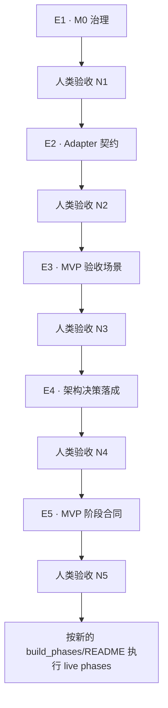

# Research OS 构建执行手册

这份文档告诉人类操作者：当前应该把哪个 prompt 发送给 Code Agent、什么时候发送、
Agent 必须交付什么证据，以及人类如何验收后才允许进入下一步。

## 权威文件与职责

- [map/index.md](map/index.md) 是唯一的构建状态源：waypoint、edge、状态、证据和偏差都记录在这里。
- [map/prompts/](map/prompts/) 存放一次一个、可交给 fresh Code Agent 会话执行的 edge prompt。
- [build_phases/](build_phases/README.md) 是 MVP 执行合同层；E3、E4 提供输入，E5 生成真正的 live phase prompts。
- [GOAL.md](GOAL.md) 定义长期方向、M0–M4 治理顺序与闸门。
- [CONTEXT.md](../CONTEXT.md) 定义 Research OS MVP 和相关领域词汇。
- [HANDOFF.md](../HANDOFF.md) 保留已确认决策；Research OS 构建进度本身只写回 map。

当本手册与 map 状态冲突时，以 `map/index.md` 为准；不要在本文件维护第二份进度状态。

## 先理解两个状态系统

### Waypoint 状态

| 状态 | 含义 | 谁负责 |
|---|---|---|
| `approved` | 人类批准了目标状态和验收方法，但工作尚未完成 | 人类 |
| `in-progress` | Agent 已开始执行进入该 waypoint 的 edge | Agent |
| `delivered` | Agent 自检通过并写回了 `agent_verdict` 与 `evidence` | Agent |
| `verified` | 人类亲自运行或完成验收并记录 `human_verdict` | 仅人类 |

### Edge 状态

| 状态 | 含义 |
|---|---|
| `drafted` | prompt 可能已存在，但前置 waypoint 尚未验证或仍需人类审阅 |
| `ready` | prompt 已组装、来源 waypoint 已到达，方向性目标也已获人类审阅 |
| `running` | Agent 正在执行 |
| `done` | Agent 已交付目标 waypoint，等待或已经完成人类验收 |

`delivered` 不等于完成。只有人类把 waypoint 验证为 `verified`，依赖它的下一条 edge
才可以变成 `ready`。

## 每一步都使用同一个执行循环

1. 打开 [map/index.md](map/index.md)，确认要执行的 edge 是 `ready`。
2. 为该 edge 新建一个 Code Agent 任务；不要把多个 edge 合并到同一会话。
3. 发送该 edge prompt 的路径，并要求 Agent 完整读取后直接执行。
4. Agent 开始时应把 edge 改为 `running`、目标 waypoint 改为 `in-progress`。
5. Agent 自检通过后，应把 edge 改为 `done`，目标 waypoint 改为 `delivered`，并写入证据。
6. 人类亲自执行下文的验收。通过后，在 map 中记录 `human_verdict: pass`、验收证据，
   并把 waypoint 改为 `verified`；同时更新 Mermaid 节点样式和 calibration ledger。
7. 如果人类验收失败，把 waypoint 退回 `in-progress`、edge 退回 `ready`，记录偏差后重跑。

每次 Agent 任务都应保持现有未相关工作不变，并在结束前运行 prompt 指定的检查以及
[`./verify.sh`](../verify.sh)。失败、未运行和 blocked 必须如实区分。

## 当前推荐路线

虽然 E1、E2、E3 都从 N0 出发并已是 `ready`，单 Agent 顺序执行时仍应遵守 GOAL 的
`M0 → M1 → M2` 顺序：



## 第一步：E1 — 清零 M0 治理债务

### 发送前

- `map/index.md` 中 N0 必须是 `verified`。
- E1 必须是 `ready`。
- 你需要在本次 Agent 任务中保持在线，因为 Paper_VAE 的地位必须由你选择。

### 发送给 Agent

```text
执行 os-build/map/prompts/E1-governance-m0.md。
完整读取该 prompt 和它引用的仓库证据，直接执行，不要只给计划。
```

Prompt：[E1-governance-m0.md](map/prompts/E1-governance-m0.md)

### Agent 应交付

- HANDOFF D4 中的 `OS_INTRO.html` 表述成为准确的历史说明。
- Paper_VAE 的两种处理方案及仓库证据。
- 执行你选择的方案，并把选择与理由写入 HANDOFF Decisions。
- N1 为 `delivered`，包含 `agent_verdict`、命令结果和文件路径证据；E1 为 `done`。

### 人类验收 N1

运行：

```bash
git grep -n OS_INTRO -- '*.md'
```

通过条件：

- 所有命中都只是历史性说明，没有任何文本仍把已删除的 `OS_INTRO.html` 当成当前入口。
- HANDOFF Decisions 有 Paper_VAE 决策行，内容与你实际选择及理由一致。
- Agent 报告的 `./verify.sh` 通过；你可再次运行确认。

全部通过后，将 N1 标为 `verified`。不通过则不要进入 E2。

## 第二步：E2 — Agent adapter 契约成文

### 发送前

- 推荐先完成并验证 N1，以遵守 `M0 → M1`。
- E2 必须是 `ready`。

### 发送给 Agent

```text
执行 os-build/map/prompts/E2-adapter-contract-m1.md。
完整读取该 prompt 和它引用的仓库证据，直接执行，不要只给计划。
```

Prompt：[E2-adapter-contract-m1.md](map/prompts/E2-adapter-contract-m1.md)

### Agent 应交付

- INSTRUCTION 中的人读 `Agent adapters` 对照表及跨-agent skill 格式说明。
- INSTRUCTION 核心文本和 README 不再把两个现有 adapter 写成不可扩展的内核前提。
- HANDOFF D7 与已注册 adapter 数量的语义一致。
- N2 为 `delivered` 且有证据；E2 为 `done`。

### 人类验收 N2

运行：

```bash
rg -n '\.claude|\.agents' INSTRUCTION.md
```

逐条查看输出。通过条件：

- 具体 adapter 目录名只出现在 `Agent adapters` 对照表或该表直接解释中。
- README 的安装说明引用 adapter 契约，不再把两份目录写成永久不变的内核事实。
- 新增第三个 adapter 在概念上只需要入口指针和表中一行，而不是改 OS 核心协议。
- `./verify.sh` 通过。

全部通过后，将 N2 标为 `verified`。不通过则不要进入 E3。

## 第三步：E3 — 定义 MVP 验收场景

### 发送前

- 推荐 N1、N2 均已 `verified`。
- E3 必须是 `ready`。
- 这是方向性、交互式任务；你必须在线逐项回答 Agent 的 grilling 问题。

### 发送给 Agent

```text
执行 os-build/map/prompts/E3-acceptance-scenario.md。
这是交互式方向性任务。完整读取 prompt 后直接开始，并按一次一个问题的方式与我确认每个验收步骤。
```

Prompt：[E3-acceptance-scenario.md](map/prompts/E3-acceptance-scenario.md)

### Agent 应交付

- `os-build/build_phases/mvp-acceptance-scenario.md`。
- 一份与具体载体解耦的七步 MVP 清单，以及 circle_packing 的实例化对应栏。
- 每一步都有：验收文件、验收命令或动作、明确通过条件，并且不依赖 transcript。
- N3 为 `delivered` 且记录你的全文批准作为证据；E3 为 `done`。

### 人类验收 N3

逐步阅读场景文档，确认以下七步全部存在：

1. 接收 Research Input Artifact；
2. 放置到正确 OS 边界；
3. 理解并记录当前研究状态；
4. 在授权和预算内续研；
5. 用可追溯证据评估；
6. 捕获并按证据晋升经验；
7. 不读 transcript 也能交还人类。

对每一步，你必须能够回答：“验收时看哪个文件、运行什么命令或动作、什么结果算通过？”
任一步含糊都不通过。全文与你批准的 circle_packing 载体、全新输入终验条款和自治边界
一致后，才把 N3 标为 `verified`。

## 第四步：E4 — 落成纯会话协议架构决策

### 发送前

- N3 必须是 `verified`，且场景文档存在。
- 由于 N4 是方向性 waypoint，你需要审阅 E4 prompt。
- 满足以上条件后，才在 map 中把 E4 从 `drafted` 改为 `ready`。

### 发送给 Agent

```text
执行 os-build/map/prompts/E4-architecture-decision.md。
完整读取 prompt 和已经验证的 MVP 验收场景，直接执行；不要重新开放已完成的架构偏好投票。
```

Prompt：[E4-architecture-decision.md](map/prompts/E4-architecture-decision.md)

### Agent 应交付

- `os-build/build_phases/mvp-architecture-decision.md`。
- 七步场景到现有文件、skills 和阶段合同的机制映射。
- 纯会话协议的正式选择与至少两个被排除方案的证据性理由。
- 正式决策与 [N4 教程](map/tutorials/N4-architecture-options.md) 互相链接。
- N4 为 `delivered` 且有证据；E4 为 `done`。

### 人类验收 N4

不看决策文档，尝试向别人说明：

1. 选择了什么：纯会话协议；
2. 为什么它能承载 MVP：阶段合同和现有 skills 覆盖七步，无需新机制；
3. 为什么不优先做 thin launcher：它只负责启动 pi，不覆盖研究闭环；
4. 为什么不做机器状态文件：没有 OS Feedback 证据，且会越过 M4 闸门。

你能准确复述所选路径和至少两个排除理由，且决策文档与 N3 场景、GOAL、HANDOFF 一致，
才把 N4 标为 `verified`。

## 第五步：E5 — 生成完整 MVP 阶段合同

### 发送前

- N4 必须是 `verified`。
- `mvp-acceptance-scenario.md` 与 `mvp-architecture-decision.md` 都必须存在。
- 满足条件后，把 E5 从 `drafted` 改为 `ready`。

### 发送给 Agent

```text
执行 os-build/map/prompts/E5-mvp-phase-contract.md。
完整读取 prompt、已验证的验收场景和架构决策，直接生成完整 MVP 阶段合同；不要执行任何阶段。
```

Prompt：[E5-mvp-phase-contract.md](map/prompts/E5-mvp-phase-contract.md)

### Agent 应交付

- 重写后的 `os-build/build_phases/README.md`。
- 一组按稳定输入、产物和验收串联的 live `phase-*.md` prompts。
- README 中的覆盖矩阵：阶段、N3 步骤、circle_packing 工作项、输入、产物、人类验收、下一阶段。
- 每个 live prompt 都能在 fresh Agent 会话中独立执行，并包含权限边界、blocked 路径、
  可追溯证据、中文 HTML 教程合同和稳定 handoff。
- `archive-launcher/` 完整保留并明确不在执行序列。
- N5 为 `delivered` 且有证据；E5 为 `done`。

### 人类验收 N5

打开新的 [build_phases/README.md](build_phases/README.md)，逐行检查覆盖矩阵：

- N3 七步全部至少被一个 live phase 覆盖；
- 每个 phase 都有明确前置输入和下一阶段；
- 没有与七步场景对应不上的孤儿 phase；
- 没有要求执行 `archive-launcher/`；
- 没有新增 launcher、数据库、服务、manifest、工作流 CLI 或 GUI 执行面；
- 每个 prompt 都写明人类可执行的验收和失败/blocked 处理。

全部通过后，将 N5 标为 `verified`。

## N5 之后如何继续

N5 验证后，不要再按本文件猜测 live phase 顺序。打开 E5 新生成的
`os-build/build_phases/README.md`，严格按照其中列出的顺序，每个 live prompt 启动一个
fresh Agent 任务，并继续使用相同的 `running → delivered → verified` 循环。

当前 map 预期后续涵盖：

- E6：circle_packing 立项、冻结评测器和 tier-2 保护；
- E7/E8：intake、continuation 与单线程 Research Run；
- E9：受控并行回合；
- E10：独立评审和经验回灌；
- E11–E13：用全新输入完成端到端验收，并检查 M0/M1 无回归。

这些 edge 尚未全部组装成可发送 prompt；只有 map 标为 `ready` 的 edge 才能执行。

## 永远不要发送的 prompts

不要执行 [build_phases/archive-launcher/](build_phases/archive-launcher/) 下的四个文件。
它们是已冻结的 thin-launcher 历史支线，只用于解释被排除的架构方案，不覆盖 Research OS
MVP 的 intake、continuation、evaluation、experience promotion 和 human handoff。

只有当人类未来显式重新开启 launcher adapter 支线、更新这些历史 prompt 并在 map 中
记录新路线后，它们才可能重新成为执行材料。

## 快速检查清单

每次发送 prompt 前确认：

- [ ] edge 是 `ready`，不是仅仅“prompt 文件存在”；
- [ ] 来源 waypoint 已是 `verified`，或确实是起点 N0；
- [ ] 方向性目标已经由人类审阅；
- [ ] 使用新的 Agent 任务，没有把两条 edge 合并；
- [ ] Agent 知道必须写回 map，而不只是修改 territory 文件。

每次接受 Agent 交付前确认：

- [ ] 目标 waypoint 是 `delivered`，并有 `agent_verdict` 和可复现证据；
- [ ] edge 是 `done`，Mermaid 与 ledger 一致；
- [ ] prompt 要求的检查和 `./verify.sh` 均有准确结果；
- [ ] 你亲自完成了 waypoint acceptance；
- [ ] 只有验收通过后才记录 `human_verdict: pass` 和 `verified`。
