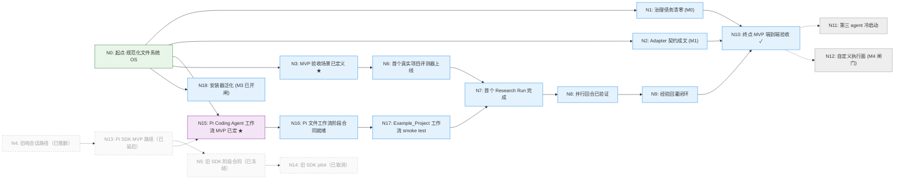

# Map: Research OS — 从规范化文件系统到可接管的研究工作流 MVP

**Start:** 规范化的文件系统 OS：入口链、三层记忆、paper-wiki、skills hub、项目模板、只读监控 UI、治理文档（GOAL/CONTEXT/HANDOFF）均已就绪，`./verify.sh` 通过。
**Destination:** Human Owner 从 Research Workspace 根目录启动 Pi Coding Agent，选择一个项目并批准文件化 Run Contract；Pi 在保持终端打开的有界回合中产出验证、Checkpoint 与 Review Package，Human Owner 或 fresh agent 不依赖 transcript 即可接管。Git 是可选增强；当前 MVP 不冒充自定义 autonomous runtime。

> 用户最初命名的路点（原话）："点A……创建一个 paper-wiki 来方便保存、检索和分类论文，同时人类也可以阅读"——已建成，含于 N0；"点B……穿件 project-folder 来方便多个 subagent 在不同的 project folder 里执行任务"——即 N8 并行回合。

## Idea ledger

| ID | Idea (verbatim) | Disposition |
| --- | --- | --- |
| I1 | “我打算用pi agent SDK来作为运行时来运行我的research OS” | N13、E16 |
| I2 | “这样不管对任何项目进行科研，都只需要打开这个Research OS的根目录，就可以统领全局。” | N13、N14 |
| I3 | “这个过程，当人类休息或者睡觉的时候，我在想可不可以让Agent自主地进行研究？” | N13、N14 |
| I4 | “默认应该支持无git，但是用户安装了git 可以实现更好的版本控制” | N13、N14 |
| I5 | “我同意，先从一个project开始” | N14 |
| I6 | “我尝试过之后发现学习路线太陡峭了，我对typescript语法完全啊不懂，pi agent SDK可以下阶段再接入，现在使用pi code agent是不是就可以实现一个MVP” | N15、N16、N17、E20–E23 |
| I7 | “我个人更倾向于现在先删除os-runtime， 这样会对路线造成干扰，也会让上下文变得更加复杂。等我根据参考的项目进行学习之后，再用Pi Agent SDK来构建。” | N15、E20 |
| I8 | “现在梳理os-build 下的文件，精简和删除多余的文件和内容” | N15、E20 |
| I9 | “我暂时删除了Paper_VAE，第一个真实示例项目采用os-build/references/EurekAgent 中的cirle packing任务。 smoke test 还是使用projects-folder/Example_Project” | N1、N3、N6、N17、E1、E22、E23 |

## Overview

★ = directional（方向性节点，定稿前需教程 + 你的知情选择）。虚线 = 证据闸门（GOAL M3/M4），不排期。

## Waypoints

### N0 — 起点：规范化文件系统 OS
- state: 入口链（AGENTS/CLAUDE→INSTRUCTION→FILETREE→memory）、三层记忆、paper-wiki（用户"点A"，已建成）、skills hub + 安装器、项目模板、os-ui 只读监控、GOAL/CONTEXT/HANDOFF 治理文档均存在且一致。
- acceptance: 我运行 `./verify.sh`，四项检查全部 OK。
- type: executive
- status: verified
- human_verdict: pass — verify.sh 于 2026-07-17 全绿（本会话）。

### N1 — 治理债务清零（GOAL M0）
- state: `OS_INTRO.html` 陈旧引用只剩历史性说明；`projects-folder/Paper_VAE/` 按 Human Owner 决定暂时删除，HANDOFF 记录恢复边界，portfolio 不把它列为活动项目。
- acceptance: 我运行 `git grep -n OS_INTRO -- '*.md'`，只见历史性说明；运行 `test ! -e projects-folder/Paper_VAE` 成功；HANDOFF Decisions 明确恢复需新授权，恢复后成为活动项目前须登记 portfolio 并补项目记忆。
- type: executive（含一个交给我的二选一，但两个选项都不改地图走向）
- status: approved
- tutorial: —
- agent_verdict: —
- human_verdict: —
- evidence: —

### N2 — Agent adapter 契约成文（GOAL M1）
- state: INSTRUCTION.md「Extending the OS」下有「Agent adapters」对照表；内核文本（表外）不再硬编码任何具体 agent 目录；README 同步；HANDOFF D7 加注。
- acceptance: 我在 INSTRUCTION.md 里搜 `.claude` 和 `.agents`，除 adapter 表外零命中。
- type: executive
- status: approved
- tutorial: —
- agent_verdict: —
- human_verdict: —
- evidence: —

### N3 — MVP 验收场景已定义 ★
- state: 一份场景文档把 CONTEXT.md 的 MVP 定义翻译成可判定清单：每一步（intake→放置→续研→评估→捕获→交还）各有"通过/不通过怎么判"的证据项；首个真实项目/场景载体已选定（**circle_packing**，从 EurekAgent 任务规范重新实现，备选 B 论文复现、C 合成场景被否）；`Example_Project` 只承担此前的工作流 smoke test；终点 N10 用全新输入证明复用；经我批准。
- acceptance: 我逐步读场景文档，对每一步都能说出验收时看哪个文件、跑哪条命令；有含糊步骤即不通过。
- type: directional（载体选错，N6–N9 整条巷道重画）
- status: approved
- tutorial: —（待 grilling 中按需生成）
- agent_verdict: —
- human_verdict: —
- evidence: —

### N4 — MVP 最小架构路径已选定 ★
- state: 2026-07-17 选择的纯 session protocol 历史路径；MVP 原计划只由 N5 阶段合同和现有 skills 承载，Pi SDK 执行面后置。
- acceptance: 历史节点，不再验收。
- type: directional（架构选错 = build_phases 重写两遍）
- status: dead
- tutorial: —（历史教程已从工作树删除，可由 Git 恢复）
- agent_verdict: fail — 该路径不能承载用户随后明确要求的 SDK 内嵌、自主循环与最小 TUI。
- human_verdict: fail — 2026-07-18 用户明确要求“正式修改”。
- evidence: `docs/adr/0001-pi-sdk-autonomous-mvp.md`；HANDOFF「Research OS route-map decisions」。
- post-mortem: 选择时把“先证明文件协议”作为 MVP；随后用户明确产品本体是根目录控制面，并要求 Pi SDK 驱动的无人值守自主研究，因此该方向性假设被推翻。历史教程保留。

### N5 — 旧 Pi SDK 阶段合同（已冻结）
- state: 2026-07-18 验证过的七阶段 Pi SDK 学习/施工合同；Phase 01 已交付真实 SDK spike，其余阶段因学习顺序改变而冻结，不再是当前 MVP 前置条件。
- acceptance: 历史节点，不再继续验收；若未来重开 SDK，必须以新的 Human Owner 决策和当时 API 证据重审合同。
- type: executive
- status: dead
- tutorial: —
- agent_verdict: pass — 合同本身完整，Phase 01 的 SDK Session、类型检查和离线测试均成功。
- human_verdict: fail — 2026-07-19 Human Owner 亲自尝试学习/调试后确认 TypeScript 路线现阶段过陡，要求 SDK 下阶段再接入。
- evidence: ADR-0001、本节点 verdict 与 Git 历史中的七阶段合同；历史 phase 文件已从工作树删除。
- post-mortem: 技术方向可行，但把 runtime 学习放在工作流验证之前造成了不必要的认知耦合。不继续 Phase 02；阶段记录保留为历史，未提交的 runtime 实现按 Human Owner 决定删除。

### N6 — 首个真实项目的冻结评测器上线并受保护
- state: circle_packing 立项完成（idea card→实例化→登记）；独立评测器自测全过并 git 冻结；tier-2 保护（deny 规则）部署；分数只能来自评测器写出的 `result.json`。
- acceptance: 我运行评测器自测命令，看到全部固定用例通过；查看项目 `.claude/settings.json` 存在对 `Code/evaluator/**` 的 deny 规则。
- type: executive
- status: approved
- tutorial: —
- agent_verdict: —
- human_verdict: —
- evidence: —

### N7 — 首个真实 Research Run 完成（单线程回合）
- state: rounds 1–2 跑完：`Code/runs/<round>/result.json` 由评测器写出；PROJECT_MEMORY.md 有 progress log 与 OS Feedback 条目（或显式 none）；每轮一个 git commit。
- acceptance: 我不读任何 transcript，仅凭 round 产物能复述该轮做了什么、得分多少、OS 哪里出了摩擦。
- type: executive
- status: approved
- tutorial: —
- agent_verdict: —
- human_verdict: —
- evidence: —

### N8 — 并行回合已验证（用户"点B"）
- state: 一次受控并行回合完成：2–3 个异构方法在 `Tasks/<approach-id>/` 工作区并行，同一冻结评测器排名，仅胜者合并回主线；败者工作区保留未污染。
- acceptance: 我看到排名表与合并记录；抽查一个败者工作区，其内容完整且主线无它的痕迹。
- type: executive
- status: approved
- tutorial: —
- agent_verdict: —
- human_verdict: —
- evidence: —

### N9 — 经验回灌闭环完成
- state: 中期与末期制品评审报告在 `Evaluations/`；OS Feedback 幸存条目分两批回灌到模板/INSTRUCTION/skills；回灌记录在案。
- acceptance: 我随机抽一条幸存的 OS Feedback，能在 OS 层文件的 git diff 里指到它引起的具体修改。
- type: executive
- status: approved
- tutorial: —
- agent_verdict: —
- human_verdict: —
- evidence: —

### N10 — 终点：MVP 端到端验收通过
- state: 我提供一个**全新的** partial Research Input Artifact，agent 完成放置→理解→续研→评估→经验捕获→交还控制，全程产物可追溯；我通过 HANDOFF/PROJECT_MEMORY/os-ui 无缝接管，全程不读 transcript；M0/M1 项无回归。
- acceptance: 我按 N3 场景文档的清单逐项打勾，全部通过。
- type: executive（验收清单来自 N3 的方向性选择）
- status: approved
- tutorial: —
- agent_verdict: —
- human_verdict: —
- evidence: —

### N11 — 第三 agent 冷启动通过
- state: 某真实第三 agent 仅凭一行入口文件完成一个只读任务。**2026-07-22 拆分**：原本挂在本节点上的"安装器随 adapter 表泛化"已独立为 N18 并先行开工，因为 M3 的真实驱动力是多安装目标，与第三 agent 无关。本节点回归纯粹的 agent-agnostic 冷启动验证。
- acceptance: 我看着该 agent 从冷启动跑完"总结当前 portfolio 状态"。
- type: directional
- status: proposed（gated：真实第三 agent 可用才开工；不排期）

### N18 — 安装器泛化（GOAL M3，2026-07-22 开闸）
- state: `research-skill-installer` 从硬编码两目录改为目标表驱动（本仓库两目录 + 全局 + 各 Research Project）；安装形态按来源分 symlink / copy；`sync-back` 删除。决策全文见 HANDOFF「Skill-management decisions (2026-07-22)」。
- acceptance: 一条命令把同一 hub skill 装进全部已注册目标；新增目标只加表行、不改安装器逻辑；**且有实测证据表明 Claude Code 与 Codex 各自都跟随 symlink 目录**（该行为未见于任何官方文档，两者需分别验证）。
- type: mechanical
- status: executing（2026-07-22 Human Owner 修订 M3 触发条件后开闸）
- evidence: 2026-07-22 完成安装形态迁移——15 个 symlink + 6 个 copy（`mattpocock-skills`，按 SOURCE.md 的 `Install form: copy`），0 跳过、0 悬空。**symlink 跟随性由 Human Owner 在 Claude Code 与 Codex 上分别实测通过**（`filetree-simple` 试点）。`verify.sh` 的四条恒真 `diff -rq` 已替换为形态与完整性检查，并用三种注入故障（悬空链接、形态错配、镜像副本漂移）验证其确实会失败。
- remaining: 已完成安装器改写（目标表驱动、`sync-back` 删除、`targets`/`disable`/`enable`/`--json` 新增）、生成器改为消费安装器输出、os-ui Store 的安装矩阵与逐位置停用开关。停用机制经两次实测定稿（原地改名被证伪，改用 `.disabled/` 目录，Claude Code 与 Codex 均验证）。尚未开工：把兄弟仓库（harness_platform、LSN-AI）纳入目标表。

### N12 — 自定义执行面 Agent Console（M4 闸门）
- state: 工作流 MVP 产生真实摩擦证据后，是否用 Pi Agent SDK、自定义 TUI 或 localhost GUI 执行面实现机械权限、恢复与跨 Session 管理，形态届时再定。**2026-07-22 开了一条细缝**：`os-ui` 获准执行 `SKILL.md` ↔ `SKILL.md.disabled` 重命名以逐位置停用/启用 skill，写通道为随 `start.sh` 生死的 Vite 中间件。安装、删除、常驻服务、SSE 及其余动作端点仍在闸门内。
- acceptance: N10 之后根据 Pi Coding Agent 工作流证据另行定义；自定义 runtime 或 GUI 不阻塞当前 MVP。
- type: directional
- status: proposed（gated：除已开的停用/启用细缝外，其余待工作流 MVP 通过后再由 Human Owner 开闸；不排期）

### N13 — Pi Agent SDK 自主运行路径（已延后）★
- state: 2026-07-18 选定、2026-07-19 完成 Phase 01 技术验证后延后的 embedded SDK + custom TUI 路径。
- acceptance: 历史节点，不再验收；ADR-0001 保留原理由，ADR-0002 记录 supersession。
- type: directional
- status: dead
- tutorial: —（旧架构教程已删除；新决策以 ADR-0002 为准）
- agent_verdict: pass — 架构边界成立，Phase 01 证明 SDK 可嵌入并可观察。
- human_verdict: fail — 2026-07-19 Human Owner 根据实际学习体验决定延后 SDK，而非否定其长期价值。
- evidence: `docs/adr/0001-pi-sdk-autonomous-mvp.md`、本节点/E18 的历史验证记录与 Git 历史；SDK phase/tutorial 和未提交的 `os-runtime/` 均已删除。
- post-mortem: 路线错在时序，不在技术可行性：它要求 Human Owner 同时学习 TypeScript、事件驱动 SDK 和 Research OS 产品设计。成功运行事实保留，runtime 实现不保留；未来从参考项目和最新 API 重新学习。

### N14 — 旧 Example_Project SDK pilot（已取消）
- state: 原计划通过自定义最小 TUI、`PiAgentBackend` 和确定性写策略完成 Example_Project pilot；未执行。
- acceptance: 历史节点，不再验收。
- type: executive
- status: dead
- tutorial: —
- agent_verdict: fail — 依赖已延后的 N13/N5 路径。
- human_verdict: fail — 2026-07-19 接受用 Pi Coding Agent 现成 TUI 先完成工作流 MVP。
- evidence: `docs/adr/0002-pi-coding-agent-workflow-mvp.md`。
- post-mortem: pilot 的研究任务与文件验收仍有价值，但运行载体和确定性权限要求被新 N17 替代。

### N15 — Pi Coding Agent 工作流 MVP 路径已定 ★
- state: ADR-0002、GOAL、HANDOFF、CONTEXT 与本地图一致声明：Human Owner 在 Research Workspace 根目录使用 Pi Coding Agent 现成交互 TUI，批准一个 Project/Task 的文件化 Run Contract，并让 Pi 在终端保持打开时执行有界工作；验证、Checkpoint、Review Package 和项目文件负责持久接管。当前工作树不保留 `os-runtime/`，`os-build/` 只保留当前施工入口、权威路线和参考资料；dead 路线细节由 map + Git 历史审计。当前不宣称自定义 runtime、确定性权限、daemon 或主动跨 Session 调度；Git 仅为可选增强。
- acceptance: 我能向别人解释“Pi Coding Agent 工作流 MVP”和“未来 Pi Agent SDK 自主 runtime”的区别，并指出当前依靠流程复核、以后才可能机械强制的边界；运行 `test ! -e os-runtime` 成功，且 `os-build/build_phases/` 不含历史 phase prompts、`map/prompts/` 只含非 dead edge prompts。
- type: directional
- status: delivered
- tutorial: —
- agent_verdict: pass — ADR-0002、领域词汇、GOAL、阶段入口、SDK 移除说明与交接记录已对齐；未提交的 `os-runtime/` 和 os-build 中 dead/deferred 施工文件已按 Human Owner 决定删除，参考项目保留并新增索引。
- human_verdict: pending — 2026-07-19 已接受口头成功标准，待复核正式落盘表述。
- evidence: `docs/adr/0002-pi-coding-agent-workflow-mvp.md`、`os-build/GOAL.md`、`CONTEXT.md`、`HANDOFF.md`、`os-build/build_phases/README.md`。

### N16 — Pi Coding Agent 文件工作流阶段合同就绪
- state: `build_phases/` 含三份可独立执行的合同：文件化 Run Contract → Example_Project 有界执行与产物 → fresh human/agent 接管验收；每份都只依赖 Pi 现成 TUI、plain files 与已有项目验证，不要求 TypeScript。
- acceptance: 我读阶段合同后，能指出每段的输入、文件产物、验证命令、停止条件和人类验收；其中不含 SDK、custom TUI 或伪装成强制机制的提示词承诺。
- type: executive
- status: approved
- tutorial: —
- agent_verdict: —
- human_verdict: —
- evidence: —

### N17 — Example_Project Pi Coding Agent 工作流 smoke test 完成
- state: Human Owner 从 Research Workspace 根目录启动 Pi Coding Agent，批准文件化 Run Contract，让 Pi 在终端保持打开时完成 Example_Project 多随机种子稳定性 smoke test，并留下声明的验证结果、Research Checkpoint 与 Review Package；fresh human/agent 只靠文件即可继续。该项目不冒充首个真实研究项目。
- acceptance: 我不读 transcript，能根据项目文件复述目标、修改、验证、限制与下一步；我能在运行时中断或接管；报告明确写边界是流程/复核而非确定性 runtime enforcement。
- type: executive
- status: approved
- tutorial: —
- agent_verdict: —
- human_verdict: —
- evidence: —

## Edges

### E1 — N0 → N1
- action: 执行 GOAL M0 清单：修正 D4 陈旧表述；验证 Human Owner 已暂时删除 Paper_VAE，并把恢复授权与重新登记边界写入 HANDOFF。
- transition_logic: 悬而未决的治理项让每个新会话重复消化矛盾；纯文档工作，GOAL 已授权，无需新证据。
- prompt: [prompts/E1-governance-m0.md](prompts/E1-governance-m0.md)
- status: ready
- deviations: —

### E2 — N0 → N2
- action: 在 INSTRUCTION.md 写「Agent adapters」节（≤30 行人读对照表），内核去两-agent 硬编码，README/D7 同步。
- transition_logic: agent-agnostic 铁律要求内核零专属假设；终点"人类无缝加入"的 agent 侧含义就是任何能读文件的 agent 走同一引导链。
- prompt: [prompts/E2-adapter-contract-m1.md](prompts/E2-adapter-contract-m1.md)
- status: ready
- deviations: —

### E3 — N0 → N3
- action: 起草端到端验收场景文档，与我逐题 grill 确认载体与每步证据项。
- transition_logic: MVP 定义已在 CONTEXT.md，但"何时算通过"没有可判定清单；先定验收再动工，避免为假想需求造机制（GOAL 原则）。
- prompt: [prompts/E3-acceptance-scenario.md](prompts/E3-acceptance-scenario.md)
- status: ready（prompt 经用户审阅通过，2026-07-17）
- deviations: —

### E4 — N3 → N4
- action: 依 N3 场景复核已选的纯会话协议，写 `os-build/build_phases/mvp-architecture-decision.md`，并让既有 N4 教程与正式决策互相链接；若场景证据推翻已选路径则停止并回图。
- transition_logic: 场景步骤决定需要哪些机制（纯约定/启动器/状态文件）；顺序颠倒就是先造机制再找用途，违背奥卡姆剃刀。
- prompt: —（dead prompt 已删除，可由 Git 恢复）
- status: dead
- deviations: 2026-07-18 directional — Human Owner 明确把 Pi Agent SDK、自主运行和最小 TUI 提前为 MVP，旧目标 N4 被判 dead；保留 prompt 作为历史。

### E5 — N4 → N5
- action: 以选定架构重写 `build_phases/` 为完整 MVP 阶段合同（HANDOFF 2026-07-16 已决策必须替换 launcher-only 包）。
- transition_logic: 阶段合同是架构的施工顺序化；没有 N4 的选择，合同没有承载物。
- prompt: —（dead prompt 已删除，可由 Git 恢复）
- status: dead
- deviations: 2026-07-18 directional — source N4 已 dead；由 E17（N13 → N5）替代。

### E6 — N3 → N6
- action: 按 HANDOFF circle_packing 清单（权威分解）立项：idea card → 模板实例化 → 评测器 Phase 0（自测+冻结）→ tier-2 保护。
- transition_logic: 场景载体确定后，评测器是一切分数可信的前提；此边可能需在组装 prompt 时按 HANDOFF 清单拆为两个会话。
- prompt: —
- status: drafted
- deviations: —

### E7 — N5 → N7
- action: 按 MVP 阶段合同引导 intake 与 continuation 进入 round 运行。
- transition_logic: round 必须踩在阶段合同上跑，其产物才能对得上 N3 的验收清单。
- prompt: —
- status: dead
- deviations: 2026-07-18 directional — 在真实 circle_packing Run 前先通过 Example_Project 的 Pi SDK/TUI pilot；由 E18、E19 替代直连。

### E8 — N6 → N7
- action: 跑 rounds 1–2 单线程回合（基线构造 + 一轮改进），每轮完整 wrap-up。
- transition_logic: 先证明"评测器→result.json→OS Feedback→commit"的最小回路成立，再谈并行。
- prompt: —
- status: drafted
- deviations: —

### E9 — N7 → N8
- action: 执行一次受控并行回合：≤3 个异构方法在 `Tasks/` 工作区并行，冻结评测器排名，仅胜者合并。
- transition_logic: 并行的价值只有在单线程回路可信后才可测量；同一评测器保证排名可比（EurekAgent 教训的 OS 化）。
- prompt: —
- status: drafted
- deviations: —

### E10 — N8 → N9
- action: 中期 + 末期两次独立制品评审；OS Feedback 幸存条目两批回灌到 OS 层。
- transition_logic: 经验只有回灌进 OS 层文件才算捕获闭环（CONTEXT.md 的 Experience Promotion 语义）。
- prompt: —
- status: drafted
- deviations: —

### E11 — N9 → N10
- action: 我提供一个全新 partial Research Input Artifact，agent 走完整 MVP 环，我按 N3 清单验收。
- transition_logic: 用未见过的输入证明环路可复用，而不是复述 circle_packing 的既有事实。
- prompt: —
- status: drafted
- deviations: —

### E12 — N1 → N10
- action: 终点验收会话中核验 M0 项无回归（陈旧引用未复活、Paper_VAE 仍保持删除或已按 D10 明确恢复并登记）。
- transition_logic: 治理清洁是"人类无缝加入"的一部分：新人/新会话不被陈旧引用误导。
- prompt: —
- status: drafted
- deviations: —

### E13 — N2 → N10
- action: 终点验收会话中核验 adapter 契约无回归（内核 grep 无专属假设）。
- transition_logic: "无缝加入"的 agent 侧 = 任何 agent 可引导，这由 adapter 契约保证。
- prompt: —
- status: drafted
- deviations: —

### E14 — N10 → N11（gated）
- action: 真实第三 agent 出现后：M1 冷启动测试 + 安装器泛化（GOAL M3）。
- transition_logic: 闸门条件写在 GOAL M3；无真实第三 agent 不开工（非目标条款）。
- prompt: —
- status: drafted
- deviations: —

### E15 — N10 → N12（gated）
- action: 工作流 MVP 通过并积累真实使用证据后，由 Human Owner 决定是否用 Pi SDK、自定义 TUI 或 localhost GUI 增加机械执行能力。
- transition_logic: 自定义 runtime 与 GUI 是文件工作流证明之后的可选机制，不再承载首次 MVP。
- prompt: —
- status: drafted
- deviations: —

### E16 — N0 → N13
- action: 正式 supersede 纯 session protocol N4；把 Pi SDK + 最小 TUI + 单项目 Autonomous Research Run 的人类决策写入 ADR、GOAL、HANDOFF、CONTEXT 与路线图。
- transition_logic: 用户明确要求的无人值守自主研究需要进程内 Agent Session、工具事件与可控循环；只靠文件协议无法成为该产品运行时。
- prompt: —
- status: done
- deviations: 2026-07-18 directional — 用户逐项确认新边界后明确要求“正式修改”；旧 N4 和相应边保留为 dead 历史。

### E17 — N13 → N5
- action: 用学习导向的小型垂直切片重写 `build_phases/`：Pi SDK hello session → tool/event → Run Contract → 权限/验证 → Checkpoint → 最小 TUI → Example_Project pilot。
- transition_logic: N13 只确定架构；可由不懂 TypeScript 的 Human Owner 学习、检查和逐步执行的阶段合同，才让架构成为可施工路线。
- prompt: —（dead route prompt 已删除，可由 Git 恢复）
- status: done
- deviations: 2026-07-18 executive — 固定实现包为 `os-runtime/`、根控制状态为 `.research-os/`，并把无人值守 shell 收窄为 guarded tools + Human Owner 在 Run Contract 中冻结的验证命令；旧 launcher 包保持只读归档。

### E18 — N5 → N14
- action: 实现最小 TUI 与 `PiAgentBackend`，在 `Example_Project` 执行多随机种子线性拟合 Autonomous Research Run，并生成 Review Package。
- transition_logic: 先用安全、已有可复现命令的合成项目验证运行时闭环，避免把 harness 缺陷带入真实科研项目。
- prompt: —（历史 SDK phase 文件已删除，可由 Git 恢复）
- status: dead
- deviations: 2026-07-19 directional — Phase 01 曾用 Node 22、SDK 0.80.10、8 个离线测试和真实 hello 证明技术可行；Human Owner 随后根据实际学习体验停止 Phase 02–07，转向 E20，并进一步删除未提交的 `os-runtime/` 实现以降低路线干扰。

### E19 — N14 → N7
- action: pilot 经 Human Owner 验收后，再让同一合同与运行时承载 circle_packing 的首个真实 Research Run。
- transition_logic: N14 证明产品机制可用，N6 证明真实项目评测器可信；两者同时成立后才进入 N7 的真实运行。
- prompt: —
- status: dead
- deviations: 2026-07-19 directional — source N14 已 dead；由 E23 替代。

### E20 — N0 → N15
- action: 根据 Human Owner 的亲身学习证据，正式把当前 MVP 重置为 Pi Coding Agent 文件工作流；写 ADR-0002，supersede ADR-0001，并对齐 GOAL、CONTEXT、HANDOFF、memory、阶段入口与路线图。
- transition_logic: 先验证 Research OS 工作流能否创造价值，再为观察到的强制/恢复需求学习和构建 SDK runtime，可降低学习与产品发现的耦合。
- prompt: —（Human Owner 在本会话直接要求并接受此路线）
- status: done
- deviations: 2026-07-19 directional — N13、N5、N14 与 E18/E19 转为 dead 历史。随后 Human Owner 判断保留未提交的 SDK spike 会干扰当前路线，明确要求删除 `os-runtime/`；成功运行过 Phase 01 的事实保留在历史记录中，但实现、依赖与可执行证据不再保留于工作树。同日进一步精简 `os-build/`：删除 dead launcher/session/SDK prompts、失效教程和未引用的 proposed 报告；map 保留 post-mortem，Git 可恢复被跟踪文件，未提交教程不可恢复。

### E21 — N15 → N16
- action: 把三段工作流编译为可分别交给 Pi/Code Agent 的独立执行合同：Run Contract 准备、Example_Project 有界执行、无 transcript 接管验收。
- transition_logic: N15 只确定产品证明；独立、可验收的文件合同才能让不懂 TypeScript 的 Human Owner 安全推进。
- prompt: —（待 N15 human-verified 后用 `writing-great-prompt` 组装）
- status: drafted
- deviations: —

### E22 — N16 → N17
- action: Human Owner 在根目录启动 Pi Coding Agent，按已批准合同完成 Example_Project 多 seed 稳定性 smoke test，并保存验证、Checkpoint 与 Review Package。
- transition_logic: 合成项目已有可复现 Python 基线，适合先暴露文件工作流摩擦而不混入真实研究风险。
- prompt: —
- status: drafted
- deviations: —

### E23 — N17 → N7
- action: Pi 工作流 smoke test 经 Human Owner 验收后，再让同一文件合同承载 circle_packing 的首个真实 Research Run。
- transition_logic: N17 证明工作流可接管，N6 证明真实项目评测器可信；两者同时成立后才进入 N7。
- prompt: —
- status: drafted
- deviations: —

## Calibration ledger

| type | checks compared | agreements | delegation |
| --- | --- | --- | --- |
| directional | 1 | 1 | human-verifies-all |
| executive | 1 | 1 | human-verifies-all |
