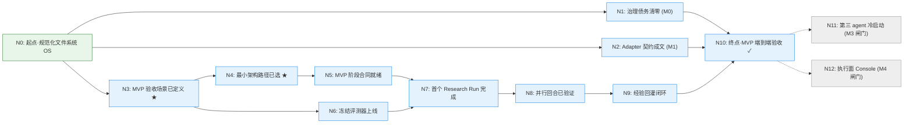

# Map: Research OS — 从规范化文件系统到可验收的 MVP

**Start:** 规范化的文件系统 OS：入口链、三层记忆、paper-wiki、skills hub、项目模板、只读监控 UI、治理文档（GOAL/CONTEXT/HANDOFF）均已就绪，`./verify.sh` 通过。
**Destination:** AI 能方便地进行科研活动、人类能无缝加入的 Research OS——具体化为 CONTEXT.md 定义的 MVP 端到端验收通过（intake → 放置理解 → 有界续研 → 可追溯产物 → 评估 → 经验捕获 → 交还人类），且不读 transcript 即可验收。

> 用户最初命名的路点（原话）："点A……创建一个 paper-wiki 来方便保存、检索和分类论文，同时人类也可以阅读"——已建成，含于 N0；"点B……穿件 project-folder 来方便多个 subagent 在不同的 project folder 里执行任务"——即 N8 并行回合。

## Overview

★ = directional（方向性节点，定稿前需教程 + 你的知情选择）。虚线 = 证据闸门（GOAL M3/M4），不排期。

## Waypoints

### N0 — 起点：规范化文件系统 OS
- state: 入口链（AGENTS/CLAUDE→INSTRUCTION→FILETREE→memory）、三层记忆、paper-wiki（用户"点A"，已建成）、skills hub + 安装器、项目模板、os-ui 只读监控、GOAL/CONTEXT/HANDOFF 治理文档均存在且一致。
- acceptance: 我运行 `./verify.sh`，四项检查全部 OK。
- type: executive
- status: verified
- human_verdict: pass — verify.sh 于 2026-07-17 全绿（本会话）。

### N1 — 治理债务清零（GOAL M0）
- state: `OS_INTRO.html` 陈旧引用只剩历史性说明；Paper_VAE 的地位（登记入 portfolio vs 声明豁免区）由我拍板并记入 HANDOFF Decisions。
- acceptance: 我运行 `grep -ri OS_INTRO --include='*.md' .`，只见历史性说明；打开 HANDOFF.md Decisions 能看到 Paper_VAE 决策行。
- type: executive（含一个交给我的二选一，但两个选项都不改地图走向）
- status: approved
- tutorial: —
- agent_verdict: —
- human_verdict: —
- evidence: —

### N2 — Agent adapter 契约成文（GOAL M1）
- state: INSTRUCTION.md「Extending the OS」下有「Agent adapters」对照表；内核文本（表外）不再硬编码任何具体 agent 目录；README 同步；HANDOFF D7 加注。
- acceptance: 我在 INSTRUCTION.md 里搜 `.claude` 和 `.agents`，除 adapter 表外零命中。
- type: executive
- status: approved
- tutorial: —
- agent_verdict: —
- human_verdict: —
- evidence: —

### N3 — MVP 验收场景已定义 ★
- state: 一份场景文档把 CONTEXT.md 的 MVP 定义翻译成可判定清单：每一步（intake→放置→续研→评估→捕获→交还）各有"通过/不通过怎么判"的证据项；场景载体已选定（**2026-07-17 用户选定：A · circle_packing**，备选 B 论文复现、C 合成场景被否；终点 N10 用全新输入补偿 A 与真实科研形态的距离）；经我批准。
- acceptance: 我逐步读场景文档，对每一步都能说出验收时看哪个文件、跑哪条命令；有含糊步骤即不通过。
- type: directional（载体选错，N6–N9 整条巷道重画）
- status: approved
- tutorial: —（待 grilling 中按需生成）
- agent_verdict: —
- human_verdict: —
- evidence: —

### N4 — MVP 最小架构路径已选定 ★
- state: 架构决策文档写明场景由什么机制承载、每个被排除方案的排除理由；经我知情选择（**2026-07-17 用户选定：A · 纯会话协议**——MVP 环由 N5 阶段合同 + 现有 skills 承载，零新机制；launcher 弧保留 GOAL 授权但不推进、不挡主线；候选 B 并行 launcher、C launcher 优先被否，理由见教程对照表）。
- acceptance: 我不看文档能向别人复述所选路径和至少两个排除理由（教程支撑到这个程度）。
- type: directional（架构选错 = build_phases 重写两遍）
- status: approved
- tutorial: [tutorials/N4-architecture-options.md](tutorials/N4-architecture-options.md)
- agent_verdict: —
- human_verdict: —
- evidence: —

### N5 — MVP 阶段合同就绪
- state: `build_phases/` 被替换为覆盖完整 MVP 环的阶段合同：每阶段有目标、输入、验收、真实文件锚定的中文 HTML 教程要求；launcher-only 旧包按 HANDOFF 2026-07-16 决策处置。
- acceptance: 我读 `build_phases/README.md`，能把阶段链条与 N3 场景步骤一一对上；找不到对不上的孤儿阶段。
- type: executive
- status: approved
- tutorial: —
- agent_verdict: —
- human_verdict: —
- evidence: —

### N6 — 首个冻结评测器上线并受保护
- state: circle_packing 立项完成（idea card→实例化→登记）；独立评测器自测全过并 git 冻结；tier-2 保护（deny 规则）部署；分数只能来自评测器写出的 `result.json`。
- acceptance: 我运行评测器自测命令，看到全部固定用例通过；查看项目 `.claude/settings.json` 存在对 `Code/evaluator/**` 的 deny 规则。
- type: executive
- status: approved
- tutorial: —
- agent_verdict: —
- human_verdict: —
- evidence: —

### N7 — 首个真实 Research Run 完成（单线程回合）
- state: rounds 1–2 跑完：`Code/runs/<round>/result.json` 由评测器写出；PROJECT_MEMORY.md 有 progress log 与 OS Feedback 条目（或显式 none）；每轮一个 git commit。
- acceptance: 我不读任何 transcript，仅凭 round 产物能复述该轮做了什么、得分多少、OS 哪里出了摩擦。
- type: executive
- status: approved
- tutorial: —
- agent_verdict: —
- human_verdict: —
- evidence: —

### N8 — 并行回合已验证（用户"点B"）
- state: 一次受控并行回合完成：2–3 个异构方法在 `Tasks/<approach-id>/` 工作区并行，同一冻结评测器排名，仅胜者合并回主线；败者工作区保留未污染。
- acceptance: 我看到排名表与合并记录；抽查一个败者工作区，其内容完整且主线无它的痕迹。
- type: executive
- status: approved
- tutorial: —
- agent_verdict: —
- human_verdict: —
- evidence: —

### N9 — 经验回灌闭环完成
- state: 中期与末期制品评审报告在 `Evaluations/`；OS Feedback 幸存条目分两批回灌到模板/INSTRUCTION/skills；回灌记录在案。
- acceptance: 我随机抽一条幸存的 OS Feedback，能在 OS 层文件的 git diff 里指到它引起的具体修改。
- type: executive
- status: approved
- tutorial: —
- agent_verdict: —
- human_verdict: —
- evidence: —

### N10 — 终点：MVP 端到端验收通过
- state: 我提供一个**全新的** partial Research Input Artifact，agent 完成放置→理解→续研→评估→经验捕获→交还控制，全程产物可追溯；我通过 HANDOFF/PROJECT_MEMORY/os-ui 无缝接管，全程不读 transcript；M0/M1 项无回归。
- acceptance: 我按 N3 场景文档的清单逐项打勾，全部通过。
- type: executive（验收清单来自 N3 的方向性选择）
- status: approved
- tutorial: —
- agent_verdict: —
- human_verdict: —
- evidence: —

### N11 — 第三 agent 冷启动通过（M3 闸门）
- state: 某真实第三 agent 仅凭一行入口文件完成一个只读任务；安装器随 adapter 表泛化。
- acceptance: 我看着该 agent 从冷启动跑完"总结当前 portfolio 状态"。
- type: directional
- status: proposed（gated：真实第三 agent 可用才开工，见 GOAL M3；不排期）

### N12 — 执行面 Agent Console（M4 闸门）
- state: os-ui 增加 localhost-only 执行面（TypeScript server + pi SDK + HTTP/SSE）。
- acceptance: 待闸门开启后随 N3 同款方式定义。
- type: directional
- status: proposed（gated：需 OS Feedback 具体证据 + 我逐项确认，见 GOAL M4；不排期）

## Edges

### E1 — N0 → N1
- action: 执行 GOAL M0 清单：修正 D4 陈旧表述；把 Paper_VAE 二选一（登记 vs 豁免）连同理由摆给我拍板并记录。
- transition_logic: 悬而未决的治理项让每个新会话重复消化矛盾；纯文档工作，GOAL 已授权，无需新证据。
- prompt: [prompts/E1-governance-m0.md](prompts/E1-governance-m0.md)
- status: ready
- deviations: —

### E2 — N0 → N2
- action: 在 INSTRUCTION.md 写「Agent adapters」节（≤30 行人读对照表），内核去两-agent 硬编码，README/D7 同步。
- transition_logic: agent-agnostic 铁律要求内核零专属假设；终点"人类无缝加入"的 agent 侧含义就是任何能读文件的 agent 走同一引导链。
- prompt: [prompts/E2-adapter-contract-m1.md](prompts/E2-adapter-contract-m1.md)
- status: ready
- deviations: —

### E3 — N0 → N3
- action: 起草端到端验收场景文档，与我逐题 grill 确认载体与每步证据项。
- transition_logic: MVP 定义已在 CONTEXT.md，但"何时算通过"没有可判定清单；先定验收再动工，避免为假想需求造机制（GOAL 原则）。
- prompt: [prompts/E3-acceptance-scenario.md](prompts/E3-acceptance-scenario.md)
- status: ready（prompt 经用户审阅通过，2026-07-17）
- deviations: —

### E4 — N3 → N4
- action: 依场景推导所需最小机制集合，写架构决策文档 + 教我看懂候选方案的教程，经我知情选择。
- transition_logic: 场景步骤决定需要哪些机制（纯约定/启动器/状态文件）；顺序颠倒就是先造机制再找用途，违背奥卡姆剃刀。
- prompt: —
- status: drafted
- deviations: —

### E5 — N4 → N5
- action: 以选定架构重写 `build_phases/` 为完整 MVP 阶段合同（HANDOFF 2026-07-16 已决策必须替换 launcher-only 包）。
- transition_logic: 阶段合同是架构的施工顺序化；没有 N4 的选择，合同没有承载物。
- prompt: —
- status: drafted
- deviations: —

### E6 — N3 → N6
- action: 按 HANDOFF circle_packing 清单（权威分解）立项：idea card → 模板实例化 → 评测器 Phase 0（自测+冻结）→ tier-2 保护。
- transition_logic: 场景载体确定后，评测器是一切分数可信的前提；此边可能需在组装 prompt 时按 HANDOFF 清单拆为两个会话。
- prompt: —
- status: drafted
- deviations: —

### E7 — N5 → N7
- action: 按 MVP 阶段合同引导 intake 与 continuation 进入 round 运行。
- transition_logic: round 必须踩在阶段合同上跑，其产物才能对得上 N3 的验收清单。
- prompt: —
- status: drafted
- deviations: —

### E8 — N6 → N7
- action: 跑 rounds 1–2 单线程回合（基线构造 + 一轮改进），每轮完整 wrap-up。
- transition_logic: 先证明"评测器→result.json→OS Feedback→commit"的最小回路成立，再谈并行。
- prompt: —
- status: drafted
- deviations: —

### E9 — N7 → N8
- action: 执行一次受控并行回合：≤3 个异构方法在 `Tasks/` 工作区并行，冻结评测器排名，仅胜者合并。
- transition_logic: 并行的价值只有在单线程回路可信后才可测量；同一评测器保证排名可比（EurekAgent 教训的 OS 化）。
- prompt: —
- status: drafted
- deviations: —

### E10 — N8 → N9
- action: 中期 + 末期两次独立制品评审；OS Feedback 幸存条目两批回灌到 OS 层。
- transition_logic: 经验只有回灌进 OS 层文件才算捕获闭环（CONTEXT.md 的 Experience Promotion 语义）。
- prompt: —
- status: drafted
- deviations: —

### E11 — N9 → N10
- action: 我提供一个全新 partial Research Input Artifact，agent 走完整 MVP 环，我按 N3 清单验收。
- transition_logic: 用未见过的输入证明环路可复用，而不是复述 circle_packing 的既有事实。
- prompt: —
- status: drafted
- deviations: —

### E12 — N1 → N10
- action: 终点验收会话中核验 M0 项无回归（陈旧引用未复活、Paper_VAE 决策仍成立）。
- transition_logic: 治理清洁是"人类无缝加入"的一部分：新人/新会话不被陈旧引用误导。
- prompt: —
- status: drafted
- deviations: —

### E13 — N2 → N10
- action: 终点验收会话中核验 adapter 契约无回归（内核 grep 无专属假设）。
- transition_logic: "无缝加入"的 agent 侧 = 任何 agent 可引导，这由 adapter 契约保证。
- prompt: —
- status: drafted
- deviations: —

### E14 — N10 → N11（gated）
- action: 真实第三 agent 出现后：M1 冷启动测试 + 安装器泛化（GOAL M3）。
- transition_logic: 闸门条件写在 GOAL M3；无真实第三 agent 不开工（非目标条款）。
- prompt: —
- status: drafted
- deviations: —

### E15 — N10 → N12（gated）
- action: OS Feedback 证据齐 + 我逐项确认后：按 HANDOFF pi 决策扩展 os-ui 执行面。
- transition_logic: 闸门条件写在 GOAL M4 与 HANDOFF「GUI gate and shape」决策行。
- prompt: —
- status: drafted
- deviations: —

## Calibration ledger

| type | checks compared | agreements | delegation |
| --- | --- | --- | --- |
| directional | 0 | 0 | human-verifies-all |
| executive | 0 | 0 | human-verifies-all |
