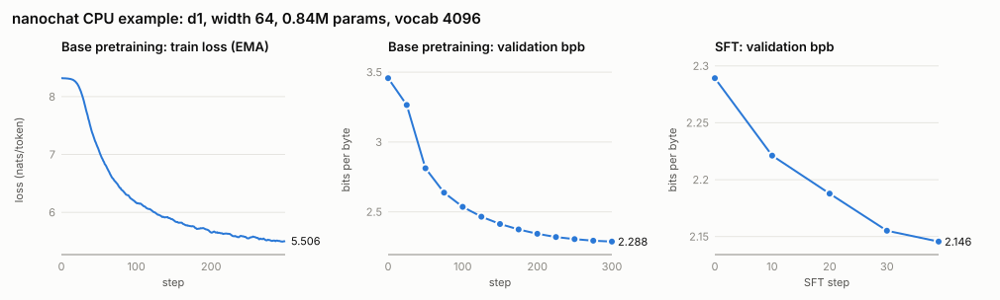
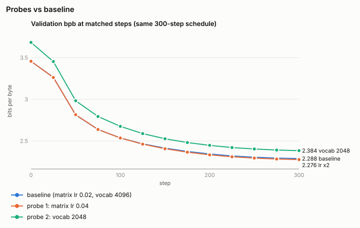

# 代码：nanochat CPU 示例

OpenResearch 的默认示例（Andrej Karpathy 的 nanochat）被缩小到每个阶段都能在
普通 CPU 上几分钟内跑完。它是每位 Research OS 用户都能跑一遍的入门示例，
**不是研究结果**。模型只有 0.84M 参数，无法回答问题，聊天回复是无意义文本属于
预期。成功的标准是：所有阶段都跑完，且预训练过程中验证集 bits per byte
（bpb）下降。英文版见 [README.md](README.md)。

## 预期开销

2026-09-26 在 Windows 11、Intel i7-12700（12 核 20 线程）、32 GB 内存上仅用 CPU
测得。数据缓存为空，但 `uv` 包缓存已存在。

| | 完整示例（`all`） | 仅 baseline 阶段 |
|---|---|---|
| 墙钟时间 | **2 分 57 秒** | 1 分 29 秒（另加 `uv sync`） |
| 单进程峰值内存 | 1.0 GB（数据下载）；训练 ≤ 0.94 GB | 同左 |
| 数据下载 | 约 0.20 GB：2 个预训练分片（约 184 MB）+ 约 14 MB SFT 数据 | 同左 |
| Python 包（仅首次安装） | 约 0.2 GB wheel，主要是 106 MB 的 CPU 版 `torch` | 同左 |
| 项目内磁盘占用 | 约 0.9 GB：`.venv` 0.68 GB，`.cache` 约 0.21 GB | 同左 |

较慢的机器耗时大致随 CPU 性能增加；全程不需要 GPU。

## 环境准备

需要 [`uv`](https://docs.astral.sh/uv/) 和 `bash`；Windows 上使用 Git Bash 的
`bash`。不做任何系统级安装。`uv` 会创建 `Code/nanochat/.venv`，数据、检查点和
日志都留在 `Code/nanochat/.cache/` 与 `Code/results/`。

## 运行（一条命令）

```bash
cd Code/nanochat
bash runs/runcpu_small.sh all
```

`all` 依次运行以下阶段。每个阶段也可以单独运行，例如
`bash runs/runcpu_small.sh base eval`：

| 阶段 | 运行内容（[runs/runcpu_small.sh](nanochat/runs/runcpu_small.sh)） | 实测 |
|---|---|---|
| `setup` | `uv sync --extra cpu --frozen` | uv 缓存已热时 < 1 秒 |
| `data` | `python -m nanochat.dataset -n 1`：1 个训练分片 + 固定的验证分片 | 13.2 秒 |
| `tok` | `tok_train --max-chars=50000000 --vocab-size=4096`，然后 `tok_eval` | 3.2 + 3.5 秒 |
| `base` | `base_train --depth=1 --aspect-ratio=64 --head-dim=64 --window-pattern=L --max-seq-len=256 --device-batch-size=16 --total-batch-size=4096 --eval-every=25 --eval-tokens=65536 --core-metric-every=-1 --sample-every=100 --num-iterations=300` | 42.3 秒 |
| `eval` | `base_eval --eval=bpb,sample --device-batch-size=1 --split-tokens=16384` | 3.7 秒 |
| `sft` | `chat_sft --load-optimizer=0 --eval-every=10 --eval-tokens=32768 --chatcore-every=-1 --num-iterations=40 --init-lr-frac=0.1 --data-keep-every=128`（含下载数据） | 20.5 秒 |
| `chat` | `chat_cli -p "What is the capital of France?"` | 2.7 秒 |
| `probe_lr` | `base` 配方加 `--matrix-lr=0.04 --model-tag=probe_lr2x` | 47.1 秒 |
| `probe_vocab` | 在 `.cache/nanochat_v2048` 训练 2,048 词表分词器，再用 `base` 配方加 `--model-tag=probe_vocab2048` | 3.3 + 35.1 秒 |
| `summary` | [tools/summarize_results.py](tools/summarize_results.py) 生成表格和图 | < 1 秒 |

每个阶段都经由 [tools/run_logged.py](tools/run_logged.py) 运行：输出同时写入
`Code/results/logs/<阶段>.log`，并在末尾追加退出码、墙钟时间和峰值常驻内存。
运行脚本会设置 `NANOCHAT_BASE_DIR`、`NANOCHAT_COMPILE=0` 和
`ARROW_DEFAULT_MEMORY_POOL=system`；手动运行单个脚本时需设置相同的变量。

## 来源

- 来源：[alphaXiv/OpenResearch](https://github.com/alphaXiv/OpenResearch)
  commit `27cb342`（`27cb34200fe82957d33d37c143adf086408281d0`），路径
  `demo/nanochat`。先把 `base/` 复制到 [nanochat/](nanochat/)，再应用示例的
  `experiment/` 覆盖文件：`runs/runcpu.sh`、`scripts/chat_sft.py`、
  `scripts/chat_cli.py` 和 `.gitignore`。
- nanochat 作者为 Andrej Karpathy，MIT 许可。
  [nanochat/LICENSE](nanochat/LICENSE) 与
  [nanochat/README.md](nanochat/README.md) 保持原样。
- 原示例的参考运行（深度 6，73.5M 参数，在 Apple M3 Max 上 5,000 步预训练、
  1,500 步 SFT）放在
  [../Baselines/openresearch-demo/](../Baselines/openresearch-demo/)：base
  验证 bpb 在第 100 步为 1.940739，第 200 步为 1.762539，最终为 1.165758。

## 相对原示例的改动

### 配方

| 设置 | 原示例（`runs/runcpu.sh`） | 本示例 | 原因 |
|---|---|---|---|
| 预训练数据 | 8 个分片（约 0.8 GB） | 1 个训练分片 + 1 个验证分片（约 184 MB） | 数据集脚本允许的最少分片数 |
| 分词器 | 词表 32,768，20 亿字符 | 词表 4,096，5,000 万字符 | 小模型的参数主要在嵌入层和输出层；训练只需 3.2 秒 |
| 模型 | 深度 6，宽度 384，73.5M 参数 | 深度 1，宽度 64（1 个 64 维头），0.84M 参数 | 能运行的最小配置；每 4,096 token 一步约 80 毫秒 |
| 上下文 / 批大小 | 512 / 32 × 512 = 16,384 token | 256 / 16 × 256 = 4,096 token | CPU 上批再大吞吐也不再提高 |
| 预训练步数 | 5,000（8,190 万 token，每个 scaling 参数 3.5 token） | 300（123 万 token，每个 scaling 参数 3.95 token） | 数据/参数比相近，耗时 42 秒 |
| 验证评估 | 每 100 步，524,288 token | 每 25 步，65,536 token | 曲线点更多，开销很小 |
| base 评估 | CORE（每任务 16 例）+ bpb + 采样 | bpb + 采样（`--eval=bpb,sample`） | CORE 需下载 26 MB 压缩包（解压 160 MB），且对极小模型接近随机（d2 训练 30 步时 CORE 为 0.0018）；在 `--eval` 中加 `core` 即可恢复 |
| SFT 数据 | 完整 SmolTalk、MMLU、GSM8K（约 980 MB） | 每个 split 约 1/128（约 14 MB），混合比例不变 | 控制下载量和内存（完整 SmolTalk 加载后约占 3 GB 内存） |
| SFT 步数 / 学习率 | 1,500 步，`--init-lr-frac` 0.8 | 40 步，`--init-lr-frac=0.1` | 0.8 时 SFT 验证 bpb 从 2.29 升到 2.63，最终仍高于起点（见下方 SFT 学习率说明）；0.1 时稳定下降 |
| SFT 评估 | 每 200 步，524,288 token | 每 10 步，32,768 token | 适配 40 步的运行 |
| 探针实验 | 以 5,000 步 baseline 为对照的 200 步探针 | 完整 300 步，每个评估点都对比 | 一次完整运行只需约 40 秒 |
| 词表探针 | 32,768 → 8,192 | 4,096 → 2,048 | 与原示例同方向（缩小词表） |

SFT 学习率说明：`chat_sft` 继承的是预训练的*命令行参数*（matrix lr 0.02、
embedding lr 0.3）。`base_train` 会按 √(4096/524288) = 0.088 为小批量缩放这些
学习率，因此 SFT 在 `--init-lr-frac=0.8` 下的起始学习率约为预训练结束时的 9 倍；
`0.1` 大致抵消了这一差异。

### 代码

`git diff --no-index <来源>/base nanochat`（被覆盖的文件则对比
`<来源>/experiment`）只显示以下改动；其余文件（包括 `uv.lock`）与来源逐字节
一致。

| 文件 | 改动 | 原因 |
|---|---|---|
| `nanochat/common.py` | 新增 `COMPILE_ENABLED` 和 `maybe_compile()`：仅在 `NANOCHAT_COMPILE=1` 时执行 `torch.compile`，有 CUDA 时默认开启，否则默认关闭 | Windows CPU 上 Inductor 需要 `PATH` 中有 MSVC `cl.exe`（本机没有）；eager 模式不需要编译器 |
| `nanochat/optim.py`、`scripts/base_train.py`、`scripts/chat_sft.py` | `torch.compile(...)` → `maybe_compile(...)` | 同一开关 |
| `tasks/common.py` | 新增 `KEEP_EVERY` 设置（默认 1 = 行为不变）。大于 1 时，通过 HTTP range 请求读取每个 parquet 分片，只取均匀分布的 row group，再抽稀到 ceil(行数/k) 行，缓存在 `task_data/.../<split>_keep<k>/` | 只下载约 1/k 的 SFT 数据，而不是约 980 MB，内存中也从不载入完整表 |
| `scripts/chat_sft.py` | 新增 `--data-keep-every` 参数（设置 `KEEP_EVERY`），验证集混合的截断值按 1/k 缩放；构建混合前并行下载 6 个 split | 在 1/k 规模下保持相同的混合比例；子采样下载受延迟限制（HF CDN 每个请求约 2 秒） |
| `nanochat/core_eval.py` | 模型没有 `max_seq_len` 时，按旋转位置编码缓存长度截断提示 | 小词表下 10-shot SQuAD 提示（2,745 token）超过缓存长度（2,560），导致 CORE 崩溃；仅在重新启用 CORE 时生效 |
| `runs/runcpu_small.sh`（新增） | 上文的分阶段运行脚本 | 一条命令跑完，每个阶段不超过 1 分钟 |

移植代码之外的新增文件：[tools/run_logged.py](tools/run_logged.py)（阶段日志）、
[tools/summarize_results.py](tools/summarize_results.py)（表格和 SVG 图，只用
标准库）。

## 结果

所有数字都来自 2026-09-26 运行的 `bash runs/runcpu_small.sh all`，保存在
[results/summary.json](results/summary.json)、
[results/training_metrics.csv](results/training_metrics.csv)（均纳入版本管理）。
`results/logs/` 中的原始阶段日志每次运行都会重新生成，不纳入版本管理（仓库忽略
`*.log`）。两次从空缓存开始的运行得到的验证
bpb 在小数点后 6 位完全一致：本机上的训练是确定性的。`summary.json` 中各阶段的耗时
来自最后一次运行，即数据已缓存时的重跑（共 152.9 秒）；本 README 引用的耗时来自首次运行。



**Baseline 预训练（在 65,536 个验证 token 上的 val bpb）：**

| 步数 | 0 | 25 | 50 | 100 | 150 | 200 | 250 | 300 |
|---|---|---|---|---|---|---|---|---|
| val bpb | 3.4564 | 3.2644 | 2.8124 | 2.5360 | 2.4136 | 2.3436 | 2.3053 | **2.2882** |

- base 评估（`base_eval`，每个 split 16,384 token）：train bpb 2.2947，val bpb 2.3622。
- SFT val bpb：2.2892（第 0 步）→ 2.2211（10）→ 2.1877（20）→ 2.1551（30）→ **2.1456**（39）。
- SFT 检查点对 "What is the capital of France?" 的回复（连续空白已合并；原始回复见
  [results/summary.json](results/summary.json) 中的 `chat_reply`）：
  `ATedning the date that is - min B`。对 0.84M 参数的模型来说，这种无意义输出
  属于预期。原示例的 73.5M 模型回答了 "Paris"，随后陷入重复。

**探针实验（相同的 300 步调度；Δ = 探针 − baseline；bpb 越低越好）：**



| 步数 | Baseline | 探针 1：matrix lr 0.04 | Δ | 探针 2：词表 2,048 | Δ |
|---|---|---|---|---|---|
| 0 | 3.4564 | 3.4564 | 0.0000 | 3.6833 | +0.2269 |
| 50 | 2.8124 | 2.8155 | +0.0031 | 2.9829 | +0.1704 |
| 100 | 2.5360 | 2.5358 | −0.0002 | 2.6756 | +0.1396 |
| 200 | 2.3436 | 2.3337 | −0.0100 | 2.4474 | +0.1038 |
| 300 | 2.2882 | 2.2761 | −0.0121 | 2.3840 | +0.0958 |

- 探针 1：把 Muon matrix 学习率翻倍，前 100 步基本无差别，之后略好；到第 300 步
  低 0.012 bpb。
- 探针 2：2,048 词表在每个评估点都更差。差距从 0.23 缩小到 0.10 bpb，但 300 步内
  没有消失。
- 复制过来的证据中没有原示例的探针结果，因此这里没有核对方向是否与原示例一致。

**各阶段墙钟时间与峰值内存**（最终一次运行）：data 13.2 秒 / 1.0 GB，分词器
3.2 秒 / 0.28 GB，tok_eval 3.5 秒 / 0.35 GB，预训练 42.3 秒 / 0.87 GB，base 评估
3.7 秒 / 0.35 GB，SFT 20.5 秒 / 0.68 GB，chat 2.7 秒 / 0.25 GB，探针 1 47.1 秒 /
0.87 GB，探针 2 3.3 + 35.1 秒 / 0.94 GB。

## 扩展说明：如何把模型调大

可调参数在 [runs/runcpu_small.sh](nanochat/runs/runcpu_small.sh) 的
`BASE_ARGS` 和 `TOK_ARGS` 中。宽度 = `--depth` × `--aspect-ratio`（64），向上取整
到 `--head-dim` 的倍数。以下开销在同一台机器上测得（eager 模式，12 线程）：

| 配置（未注明时词表为 8,192） | 参数量 | 吞吐 | 备注 |
|---|---|---|---|
| d1，宽 64，词表 4,096，T 256（本示例） | 0.84M | 约 52k tok/s（每 4,096 token 一步 80 毫秒） | 词表 2,048：0.44M 参数，约 80k tok/s |
| d2，宽 128，T 256 / T 512 | 3.54M | 约 15.5k tok/s（profiler）；`base_train` 在 T 512 下每 8,192 token 一步 470 毫秒 | base_train 峰值内存 1.9 GB。之前的计划是 800 步预训练（约 8 分钟）+ 500 步 SFT（约 5 分钟） |
| d3，宽 192 | 7.62M | 约 8.9k tok/s | |
| d4，宽 256（词表 4,096） | 11.5M（7.3M） | 约 6.4k tok/s（8.1k） | 8 或 20 线程都比默认的 12 线程慢 |
| d6，宽 384（原示例的模型） | 词表 8,192 时 26.4M（32,768 时 73.5M） | 约 2.4k tok/s | 原示例的 5,000 × 16,384 token 在本机需要 9 小时以上 |

- SFT 内存：完整加载 SmolTalk 训练集约占 3 GB 内存，整个 SFT 进程峰值为
  5.1–5.5 GB。空闲内存较少的机器请使用大于 1 的 `--data-keep-every`，并保留
  `ARROW_DEFAULT_MEMORY_POOL=system`（默认的 mimalloc 内存池曾占住约 2.3 GB
  已释放的 Arrow 内存）。
- CORE 评估（`--eval=core,bpb,sample --max-per-task=16`）在 d2 上约需 26 秒，另需
  一次性下载 26 MB。
- `--total-batch-size` 必须是 `--device-batch-size` × `--max-seq-len` 的倍数。
  `base_train` 按 √(batch/524,288) 缩放学习率，`chat_sft` 不会（见上方 SFT
  学习率说明）。
- 有可用 C++ 编译器的机器可以尝试 `NANOCHAT_COMPILE=1`；本机未测试。

## 数据

数据按需下载到 `Code/nanochat/.cache/nanochat/`（`NANOCHAT_BASE_DIR`），而不是
[Datasets/](Datasets/)。这样保留了 nanochat 自己的目录结构，且都不纳入版本管理。
本次未核对许可证条款，请查看各数据集卡片。

| 数据 | 来源 | 使用范围 |
|---|---|---|
| 预训练文本 | [karpathy/climbmix-400b-shuffle](https://huggingface.co/datasets/karpathy/climbmix-400b-shuffle) | `shard_00000`（训练）、`shard_06542`（验证） |
| SFT 对话 | [HuggingFaceTB/smol-smoltalk](https://huggingface.co/datasets/HuggingFaceTB/smol-smoltalk) | 训练 460K 行中的 3,600 行，测试 24K 行中的 190 行 |
| SFT 选择题 | [cais/mmlu](https://huggingface.co/datasets/cais/mmlu) `all` | `auxiliary_train` 99,842 行中的 781 行（在混合中 ×3），测试 110 行 |
| SFT 数学 | [openai/gsm8k](https://huggingface.co/datasets/openai/gsm8k) `main` | 训练 7,473 行中的 59 行（×4），测试 11 行 |

## 已知局限

- 这是流水线演示，不是可用的模型。聊天回复没有意义，base 评估和探针数字也不能
  推断更大模型的表现。
- 探针只用了一个随机种子。运行是确定性的，所以差值不是运行间的噪声，但种子间的
  方差没有测量；探针 1 的 −0.012 bpb 很小，可能没有实际意义。
- 探针 2 改变的不只是词表：2,048 词表模型的参数更少（0.44M 对 0.84M），而且在
  每步固定 4,096 token 时，每步看到的文本字节更少。bpb 对指标做了归一化，但没有
  对训练预算做归一化。
- 在这个规模下，`base_train` 自动缩放出的权重衰减为 λ = 7.0（d12 参考值为
  0.28）。训练仍然收敛，但这个配方远远超出了缩放规则调参时的范围。
- SFT 数据是每个 split 的 1/128 子样本。在 256 token 上下文下，SFT 数据加载器会
  跳过更长的对话（原示例的覆盖逻辑），因此模型看到的大多是短对话。
- 只在这一台 Windows 机器上测试过。在 Linux 和 macOS 上，`runcpu_small.sh` 会
  退回到 `.venv/bin/python` 和 `cp`，但这些路径没有实际运行过。
- 原来的 `runs/runcpu.sh` 按原示例保留（它把 `UV_CACHE_DIR` 设在仓库内），
  本示例不使用它。
